# CHƯƠNG 2: CƠ SỞ LÝ THUYẾT VÀ NGHIÊN CỨU LIÊN QUAN

## 2.1. Tóm tắt văn bản tự động (Automatic Text Summarization)

Tóm tắt văn bản tự động là quá trình sử dụng máy tính để tạo ra một bản tóm tắt ngắn gọn, súc tích từ một hoặc nhiều văn bản đầu vào dài hơn, mà vẫn đảm bảo giữ lại được những nội dung thông tin cốt lõi và ý nghĩa chính của văn bản gốc.

Dựa trên cách thức tạo ra bản tóm tắt, các phương pháp tóm tắt văn bản tự động thường được chia thành hai nhánh chính:

- **Tóm tắt trích xuất (Extractive)**

- **Tóm tắt trừu tượng (Abstractive)**

### 2.1.1. Tóm tắt trích xuất (Extractive Summarization)

#### Định nghĩa

Tóm tắt trích xuất là phương pháp hoạt động dựa trên nguyên lý lựa chọn các đoạn văn, câu văn hoặc cụm từ quan trọng nhất trực tiếp từ văn bản gốc, sau đó sắp xếp và ghép chúng lại để tạo thành một bản tóm tắt hoàn chỉnh.

Phương pháp này không tạo ra từ ngữ hay câu văn mới mà giữ nguyên trạng câu chữ của văn bản đầu vào. Do đó, ưu điểm của nó là đảm bảo tính chính xác về mặt thông tin và đúng ngữ pháp của các câu đơn lẻ.

#### Các phương pháp phổ biến

Trong môn học này, nhóm triển khai ba thuật toán đại diện cho các cách tiếp cận khác nhau của tóm tắt trích xuất:

**1. TF-IDF (Term Frequency-Inverse Document Frequency)**

TF-IDF không chỉ đơn thuần là đếm số lần một từ xuất hiện, TF-IDF là một công cụ giúp máy tính "hiểu" độ quan trọng thực sự của một từ trong bối cảnh một tập hợp lớn các văn bản (corpus).

Mục tiêu cốt lõi của TF-IDF là phân biệt giữa từ khóa thực sự mang lại ý nghĩa cho văn bản và những từ chỉ xuất hiện nhiều vì ngữ pháp (ví dụ: "và", "là", "các"), giúp các hệ thống tìm kiếm, phân loại hay tóm tắt văn bản hoạt động hiệu quả hơn.

- Tần suất Từ (TF - Term Frequency): Đo lường độ quan trọng cục bộ của một từ trong chính văn bản đó. Nếu một từ xuất hiện càng nhiều trong một bài viết, nó càng có khả năng cao là từ khóa chính của bài viết đó.

    Ý tưởng: Từ xuất hiện nhiều trong văn bản, càng quan trọng trong văn bản đó.
$$TF(w,s) = \frac{\text{Số lần từ } w \text{ xuất hiện trong câu } s}{\text{Tổng số từ trong văn bản } s}$$

- Nghịch đảo Tần suất Văn bản (IDF - Inverse Document Frequency): Đo lường độ phổ biến toàn cục của một từ trong toàn bộ tập dữ liệu (corpus). Nếu một từ xuất hiện trong nhiều văn bản, nó càng ít có giá trị để phân biệt một văn bản này với văn bản khác (ví dụ: từ "và"). Do đó, độ quan trọng toàn cục của nó bị giảm đi.

    Ý tưởng: Từ xuất hiện nhiều trong toàn tập dữ liệu, càng kém quan trọng để phân biệt.
$$IDF(w) = \log\left(\frac{N}{\text{Số văn bản chứa từ }\text{df}(w)}\right)$$
Điểm TF-IDF là tích của hai yếu tố này (TF * IDF). Nó làm nổi bật những từ xuất hiện nhiều trong văn bản hiện tại nhưng lại hiếm gặp trong toàn bộ tập dữ liệu khác, giúp xác định các từ khóa đặc trưng nhất.

 $$\text{tf-idf}(w) = \text{tf}(w,s) * \log(\frac{N}{\text{df}(w)})$$


$$\text{score}(s) = \frac{\sum_{w \in s} \text{tfidf}(w)}{\text{len}(s)}$$
Ví dụ:
| Thông số | Giá trị |Ký hiệu|
|------|-------|-------|
| Tổng số văn bản | 14 | N |
| Số văn bản chứa từ | 3 | df(w) |
| Số lần từ xuất hiện | 5 |TF |
| Tổng số từ trong văn bản | 106 | s |

Bảng tính TF-IDF
| Bước tính | Công thức |Giá trị |
|------|-------|-------|
| 1. Tính TF | $TF = \frac{5}{106}$ |0.0472 |
| 2. Tính IDF | $\log(\frac{14}{3})$ |0.669|
| 3. Kết quả | $0.0472 \times 0.669$ |0.0316 |
| Ghi chú | - |TF-IDF cân bằng sự quan trọng cục bộ và toàn cục. Giá trị TF-IDF càng cao thì từ càng đặc trưng cho văn bản hiện tại.|

**2. TextRank**

Nếu TF-IDF định nghĩa sự quan trọng dựa trên sự khan hiếm của từ khóa, thì TextRank định nghĩa sự quan trọng dựa trên sự kết nối (mối quan hệ).

TextRank tìm kiếm những câu văn mang tính chất "trung tâm" (centrality) — những câu có chung nhiều chủ đề, nhiều ý nghĩa với hầu hết các câu khác trong cùng một văn bản. Những câu trung tâm này thường là câu chốt đoạn, câu tóm tắt ý chính của cả bài.

Thuật toán TextRank gồm 2 bước:
- Bước 1: Xây dựng đồ thị (graph) trong đó mỗi câu là một node, và cạnh giữa hai node được định nghĩa dựa trên độ tương đồng (similarity) giữa hai câu đó. Độ tương đồng có thể được tính bằng nhiều cách, ví dụ: số lượng từ chung, cosine similarity giữa vector embedding của câu, v.v. Nếu độ tương đồng vượt qua một ngưỡng nhất định, một cạnh sẽ được tạo ra giữa hai node đó. Kết quả là một đồ thị mà các câu có nội dung tương đồng sẽ được kết nối với nhau. 

- Bước 2: Quá trình bầu chọn, áp dụng thuật toán PageRank trên đồ thị này để tính điểm quan trọng cho mỗi node (câu). Các câu có nhiều kết nối với các câu khác (đặc biệt là những câu cũng có điểm cao) sẽ nhận được điểm cao hơn. Cuối cùng, các câu được sắp xếp theo điểm số và $k$ câu có điểm cao nhất sẽ được chọn làm bản tóm tắt trích xuất.
Nguyên lý: Nếu Câu A kết nối với Câu B, Câu A đang "bỏ một phiếu bầu" cho sự quan trọng của Câu B. Đặc biệt, phiếu bầu từ một câu đã vốn rất quan trọng sẽ có sức nặng cao hơn phiếu bầu từ một câu ít quan trọng.

Thuật toán sẽ chạy vòng lặp liên tục: Điểm số truyền từ câu này sang câu khác theo các đường nối. Sau nhiều vòng lặp, hệ thống sẽ đạt trạng thái cân bằng. Những câu tích lũy được nhiều "phiếu bầu" nhất (điểm TextRank cao nhất) sẽ vươn lên dẫn đầu.

$$\text{TextRank}(C_i) = (1 - d) + d \sum_{C_j \in In(C_i)} \frac{\text{TextRank}(C_j)}{Out(C_j)}$$

**3. K-Means Clustering kết hợp Embedding**

Nếu dùng TextRank, nó có thể chọn ra 5 câu nói về "tài chính" chỉ vì chủ đề này được nhắc đến nhiều nhất mà bỏ quên hoàn toàn các chủ đề khác. Bản tóm tắt sẽ bị lặp ý và thiếu toàn diện.

Ý tưởng của K-Means: Thay vì chọn câu nổi bật, thuật toán này sẽ gom những câu cùng một chủ đề vào một nhóm (cụm/cluster). Nếu cần bản tóm tắt 5 câu, nó sẽ chia thành 5 nhóm. Sau đó, nó chọn ra 1 câu đại diện tiêu biểu nhất từ mỗi nhóm để lập thành bản báo cáo.

Mục tiêu: Đảm bảo bản tóm tắt **bao quát được mọi khía cạnh** của văn bản gốc và triệt tiêu hoàn toàn sự lặp lại thông tin (Redundancy).

Thuật toán gồm 2 bước như sau:
- Bước 1: Biểu diễn câu văn dưới dạng vector embedding. Mỗi câu được chuyển thành một vector số trong không gian đa chiều, sao cho những câu có nội dung tương tự sẽ có vector gần nhau hơn.
- Bước 2: Áp dụng thuật toán K-Means để phân cụm các câu dựa trên khoảng cách giữa các vector embedding. Kết quả là $k$ nhóm câu, mỗi nhóm đại diện cho một chủ đề hoặc khía cạnh khác nhau của văn bản gốc. Sau đó, từ mỗi nhóm, chọn ra một câu tiêu biểu nhất (ví dụ: câu gần tâm cụm nhất) để tạo thành bản tóm tắt.
**Cách trích xuất:** Đo khoảng cách hình học và lựa chọn ra một câu duy nhất nằm gần tâm (centroid) nhất của mỗi cụm. Câu này được coi là "câu trung bình cộng" ý nghĩa của cả nhóm.
**Ưu điểm:** Phương pháp này sinh ra bản tóm tắt có độ bao phủ thông tin cực rộng.
**Nhược điểm:** Thiếu liên kết giữa các câu, không có sự mạch lạc, khó đọc.

### 2.1.2. Tóm tắt trừu tượng (Abstractive Summarization)

#### Định nghĩa

Khác với cách tiếp cận trích xuất, tóm tắt trừu tượng hướng tới việc hiểu ngữ cảnh và ý nghĩa của văn bản gốc, sau đó sử dụng mô hình ngôn ngữ tự nhiên (LLM) để sinh ra một bản tóm tắt mới hoàn toàn.

Quá trình này tương tự như cách con người đọc một cuốn sách và viết lại cảm nhận bằng lời văn của chính mình. Bản tóm tắt có thể chứa các từ ngữ, cụm từ hoặc cấu trúc câu không hề xuất hiện trong văn bản gốc.

#### Mô hình BART

Các thuật toán trích xuất tạo ra bản tóm tắt khô khan, đôi khi các câu ghép lại với nhau không ăn nhập về ngữ pháp (bởi vì chúng bị lấy từ các bối cảnh khác nhau).

Muốn có một bản tóm tắt tự nhiên như con người viết, máy tính phải có khả năng đọc toàn bộ văn bản để "hiểu" ngữ cảnh (encode), sau đó dựa trên sự hiểu biết đó để tự "viết" ra từng từ một (decode).

Điểm đặc biệt của BART nằm ở quy trình tiền huấn luyện (pre-training). Thay vì dạy BART viết tóm tắt ngay, các con người đã dạy nó cách "Khôi phục văn bản". Lấy một bài báo hoàn hảo sau đó cố tình làm hỏng (Denoising) bài báo đó (Xóa ngẫu nhiên vài từ (Text Infilling), đảo lộn thứ tự các câu (Sentence Permutation), hoặc xóa luôn một đoạn dài.) Nhiệm vụ của BART là nhìn vào văn bản bị làm hỏng và phải đoán/viết lại chính xác bài báo gốc ban đầu. Cơ chế này giúp BART rất hiệu quả trong các nhiệm vụ sinh văn bản, đặc biệt là tóm tắt.

Encoder - Bộ mã hóa: Nhiệm vụ của nó là đọc văn bản đầu vào, phân tích mối liên hệ ngữ pháp, ý nghĩa giữa các từ (sử dụng cơ chế Self-Attention), và nén toàn bộ sự "hiểu biết" đó thành một khối dữ liệu toán học (gọi là Context Vector). Cơ chế "Bidirectional" (hai chiều) cho phép nó nhìn cả phía trước và phía sau của một từ để hiểu trọn vẹn ngữ cảnh (giống mô hình BERT).

Decoder - Bộ giải mã: Nhận khối dữ liệu "hiểu biết" từ Encoder, Decoder viết bản tóm tắt. Cơ chế "Auto-Regressive" (tự hồi quy) nghĩa là nó viết từng từ một; từ tiếp theo được sinh ra không chỉ dựa vào khối kiến thức ban đầu, mà còn dựa vào những từ nó vừa mới viết ra trước đó để đảm bảo câu văn suôn sẻ, đúng ngữ pháp (giống mô hình GPT).

#### Giới hạn

Mặc dù tạo ra bản tóm tắt tự nhiên và mạch lạc, các mô hình dựa trên Transformer như BART gặp phải rào cản kỹ thuật về **giới hạn cửa sổ ngữ cảnh (context window)**.

Cụ thể, BART chỉ có thể xử lý tối đa **1.024 token** (tương đương khoảng 700-800 từ) trong một lần xử lý. Giới hạn này khiến BART không thể áp dụng trực tiếp cho các văn bản siêu dài như hợp đồng pháp lý, vì việc cắt văn bản sẽ dẫn đến mất thông tin nghiêm trọng.

### 2.1.3. Tóm tắt lai (Hybrid Summarization)

#### Ý tưởng

Để khắc phục nhược điểm của cả hai phương pháp trên – tính rời rạc của Extractive và giới hạn độ dài của Abstractive – cách tiếp cận Hybrid (Lai) được đề xuất.

Ý tưởng cốt lõi là xây dựng một quy trình (pipeline) hai giai đoạn:

- **Giai đoạn 1**: Sử dụng các phương pháp Extractive để "lọc thô", trích xuất ra các câu quan trọng nhất từ văn bản dài đầu vào, đảm bảo tổng độ dài nằm trong giới hạn xử lý.

- **Giai đoạn 2**: Đưa kết quả trích xuất này vào mô hình Abstractive (như BART) để sinh ra bản tóm tắt cuối cùng mạch lạc và tự nhiên.

#### Các nghiên cứu liên quan

Nhiều nghiên cứu gần đây đã chứng minh tính hiệu quả của cách tiếp cận hybrid, đặc biệt trong các lĩnh vực chuyên ngành:

- **Nghiên cứu Tayronas Trigrams [5]**: Áp dụng mô hình hybrid kết hợp PACSUM và Gemini để tóm tắt các bản án pháp lý tại Ấn Độ.
- **Mô hình ETT (Extract-Then-Summarize) [6]**: Cũng sử dụng pipeline tương tự để xử lý văn bản dài.
- **Dự án llm-contract-analyzer [7]**: Tuy chủ yếu dựa trên LLM nhưng cũng thể hiện tư duy xử lý hai giai đoạn trong việc phân tích hợp đồng.

## 2.2. Bộ dữ liệu CUAD (Contract Understanding Atticus Dataset)

Bộ dữ liệu CUAD v1 là một tập dữ liệu chuyên ngành pháp lý quan trọng, được thiết kế để huấn luyện và đánh giá các mô hình học máy trong nhiệm vụ hiểu và phân tích hợp đồng thương mại.

### Cấu trúc dữ liệu

Dữ liệu đầu vào bao gồm:

- Thư mục `full_contract_txt/` chứa **510 file** văn bản hợp đồng thô ở định dạng `.txt`
- File `master_clauses.xlsx` đóng vai trò là nhãn (label) dữ liệu. File này chứa thông tin về các điều khoản quan trọng đã được các chuyên gia pháp lý gán nhãn trong từng hợp đồng.

### Các loại điều khoản

CUAD định nghĩa **41 loại điều khoản pháp lý** khác nhau mà một mô hình cần nhận diện. Một số nhóm điều khoản chính bao gồm:

| Nhóm | Ví dụ |
|------|-------|
| **Điều khoản về quyền hạn** | "Governing Law" (Luật điều chỉnh), "Jurisdiction" (Thẩm quyền tài phán) |
| **Điều khoản về nghĩa vụ và hạn chế** | "Non-Compete" (Không cạnh tranh), "Exclusivity" (Độc quyền) |
| **Điều khoản về tài chính và thời hạn** | "Termination for Convenience" (Chấm dứt thuận tiện), "Change of Control" (Thay đổi quyền kiểm soát) |

### Xây dựng reference (Tóm tắt mẫu)

CUAD được thiết kế cho nhiệm vụ trích xuất điều khoản (Extraction), không phải tóm tắt (Summarization), trong nghiên cứu này, nhóm xây dựng một công cụ **ReferenceBuilder**.

Công cụ này sẽ đọc dữ liệu từ file CSV gán nhãn, tìm tất cả các đoạn văn bản tương ứng với các điều khoản đã được gán nhãn cho mỗi hợp đồng, sau đó gộp lại để tạo thành văn bản "reference summarization" phục vụ cho việc đánh giá mô hình.

## 2.3. Nghiên cứu liên quan

Một số nghiên cứu mới nhất (giai đoạn 2023-2025) liên quan đến tóm tắt văn bản pháp lý và bộ dữ liệu CUAD.

### 1. CUAD-summarization (2023) [8]

Đây là một trong những nghiên cứu đầu tiên cố gắng áp dụng tóm tắt văn bản trên bộ dữ liệu CUAD. Tác giả đã thực hiện fine-tune các mô hình Transformer như BART, Pegasus và T5 trực tiếp trên dữ liệu CUAD.

**Kết quả**: Do đặc thù hợp đồng CUAD quá dài, mô hình bắt buộc phải cắt văn bản đầu vào để phù hợp với context window, dẫn đến điểm ROUGE-L chỉ đạt khoảng **0.42**.

**Điểm yếu**: Chưa có giải pháp xử lý văn bản dài hiệu quả, dẫn đến mất thông tin quan trọng rải rác trong hợp đồng.

### 2. llm-contract-analyzer (2025) [7]

Nghiên cứu này sử dụng cách tiếp cận dựa trên các Mô hình Ngôn ngữ Lớn (LLM) thông qua kỹ thuật RAG (Retrieval-Augmented Generation) hai giai đoạn kết hợp với GPT-4.

**Điểm mạnh**: Tận dụng khả năng suy luận của GPT-4 để phân tích và tóm tắt.

**Điểm yếu**: Phụ thuộc hoàn toàn vào API thương mại trả phí (OpenAI), và vấn đề về bảo mật dữ liệu hợp đồng nhạy cảm.

### 3. Tayronas Trigrams (2025) [5]

Nghiên cứu này đề xuất một pipeline hybrid kết hợp thuật toán extractive PACSUM để lọc câu và mô hình abstractive Gemini của Google để sinh tóm tắt cho dữ liệu bản án Ấn Độ.

**Kết quả**: Đạt điểm ROUGE-2 = **21.05**.

**Điểm yếu**: Tuy hiệu quả nhưng vẫn phụ thuộc vào mô hình Gemini (gọi API bên ngoài), và dữ liệu bản án có cấu trúc khác biệt so với hợp đồng thương mại CUAD.

### Bảng so sánh tổng hợp

| Nghiên cứu | Phương pháp | Dữ liệu | Điểm mạnh | Điểm yếu |
|------------|-------------|---------|-----------|----------|
| [8] (2023) | Abstractive thuần (Fine-tune BART/T5) | CUAD | Dùng mô hình chuyên biệt | Bị giới hạn độ dài, ROUGE thấp do cắt văn bản |
| [7] (2025) | RAG + GPT-4 | Hợp đồng | Chất lượng cao nhờ GPT-4 | Phụ thuộc API bên ngoài, chi phí cao và rủi ro bảo mật |
| [5] (2025) | Hybrid (PACSUM + Gemini) | Bản án Ấn Độ | Xử lý văn bản dài | Dữ liệu khác biệt, phụ thuộc Gemini API |
| **Đề xuất** | **Hybrid Pipeline (ML + Local BART) + Reranker** | **CUAD** | **Xử lý văn bản siêu dài, triển khai local, tận dụng nhãn chuyên gia** | Cần nhân sự có kinh nghiệm để quản lý và vận hành |

## 2.4. Phương pháp đề xuất

Dựa trên việc phân tích ưu, nhược điểm của các nghiên cứu trước đó và đặc thù của bộ dữ liệu CUAD, nhóm đề xuất một quy trình hybrid mới, kết hợp các thuật toán học máy truyền thống để trích xuất câu quan trọng, một cơ chế xếp hạng lại dựa trên nhãn điều khoản để tối ưu hóa nội dung, và cuối cùng là sử dụng mô hình BART được triển khai cục bộ để sinh tóm tắt trừu tượng.

Điểm nhấn và tính mới của phương pháp nằm ở các yếu tố sau:

### 1. Xử lý văn bản siêu dài

Kết hợp giai đoạn Extractive để nén văn bản và cơ chế chunking overlap (phân đoạn gối đầu) ở giai đoạn Abstractive, đảm bảo không mất mát thông tin quan trọng.

### 2. Label‑Guided Reranker (Reranker dựa trên nhãn - Điểm mới)

Thay vì chỉ dựa vào các thuật toán unsupervised (không giám sát) như TextRank để chọn câu, nhóm đề xuất tận dụng thông tin nhãn điều khoản của CUAD làm tín hiệu giám sát yếu (weak supervision) để xếp hạng lại (rerank) các câu, ưu tiên các câu chứa đựng các điều khoản cốt lõi mà chuyên gia pháp lý quan tâm.

### 3. Triển khai cục bộ (Hierarchical BART)

Sử dụng mô hình `bart-large-cnn` và triển khai trên hạ tầng GPU cục bộ, đảm bảo tính riêng tư, bảo mật cho dữ liệu hợp đồng và không phụ thuộc vào chi phí API bên ngoài.

---

# CHƯƠNG 3: PHƯƠNG PHÁP ĐỀ XUẤT

## 3.1. Kiến trúc tổng thể

Chương này trình bày chi tiết về kiến trúc hệ thống và cơ sở toán học của phương pháp được đề xuất.

Dữ liệu đầu vào là văn bản hợp đồng thương mại thô và đầu ra là bản tóm tắt mạch lạc về các điều khoản quan trọng đã được gán nhãn trong bộ dữ liệu CUAD.

### Sơ đồ pipeline

Quy trình xử lý bao gồm **7 module chính** hoạt động tuần tự:

```mermaid
flowchart LR
    A["📄 Loader<br/>Đọc file .txt"] --> B["🧹 Cleaner<br/>Làm sạch văn bản"]
    B --> C["✂️ Splitter<br/>Tách câu"]
    C --> D["🔍 Extractor<br/>Trích xuất câu quan trọng<br/><i>TF-IDF / TextRank / KMeans / Ensemble</i>"]
    D --> E["🏷️ Reranker<br/><i>Label-Guided</i><br/>Xếp hạng lại theo nhãn CUAD"]
    E --> F["📦 Chunker<br/>Phân đoạn gối đầu<br/><i>overlap=50 tokens</i>"]
    F --> G["✍️ Summarizer<br/><i>BART-large-cnn</i><br/>Sinh tóm tắt trừu tượng"]

    style A fill:#4A90D9,color:#fff,stroke:#2C5F8A
    style B fill:#5BA0E0,color:#fff,stroke:#2C5F8A
    style C fill:#6BB0E7,color:#fff,stroke:#2C5F8A
    style D fill:#F5A623,color:#fff,stroke:#C4841A
    style E fill:#E8573A,color:#fff,stroke:#B8432E
    style F fill:#8E44AD,color:#fff,stroke:#6C3483
    style G fill:#27AE60,color:#fff,stroke:#1E8449
```



1. **Loader**: Đọc file văn bản thô `.txt`
2. **Cleaner**: Tiền xử lý, làm sạch văn bản thô
3. **Splitter**: Phân tách văn bản thành các câu đơn lẻ
4. **Extractor**: Áp dụng các thuật toán học máy để trích xuất các câu quan trọng nhất (lọc thô)
5. **Reranker (Label-Guided)**: Xếp hạng lại câu dựa trên tín hiệu nhãn điều khoản CUAD để tối ưu hóa nội dung
6. **Chunker**: Phân đoạn văn bản sau khi lọc thành các khối (chunk) phù hợp với giới hạn của mô hình BART
7. **Summarizer**: Sử dụng mô hình BART để sinh tóm tắt trừu tượng cho từng chunk và kết hợp lại


## 3.2. Tiền xử lý (Preprocessing)

Là bước bắt buộc để làm sạch văn bản thô sao cho mô hình có thể xử lý hiệu quả.

### Module TextCleaner

Sử dụng thư viện `unicodedata` để chuẩn hóa văn bản về định dạng NFKC, giúp xử lý các ký tự Unicode phức tạp.

Sau đó, sử dụng các mẫu biểu thức chính quy (regex patterns) được áp dụng để:

- Loại bỏ các ký tự rác, ký tự không in được
- Chuẩn hóa khoảng trắng (thay thế nhiều dấu cách/xuống dòng liên tiếp bằng một dấu duy nhất)
- Xử lý các định dạng đặc thù trong hợp đồng như đánh số điều khoản (ví dụ: "1.1.", "Article I")

### Module SentenceSplitter

Sử dụng bộ phân tách câu của thư viện NLTK (đã được cấu hình cho tiếng Anh).

Sau khi phân tách, các câu được lọc dựa trên độ dài để loại bỏ nhiễu:

- **Loại bỏ câu quá ngắn**: `min_words=5` (thường là tiêu đề hoặc rác)
- **Loại bỏ câu quá dài**: `max_words=80` (thường là các danh sách liệt kê bị phân tách sai, gây nhiễu cho mô hình embedding)

## 3.3. Tóm tắt trích xuất (Extractive Summarization) - Cơ sở toán học

### 3.3.1. Cơ sở toán học chung

Cho một văn bản đầu vào đã được phân tách thành một tập hợp $n$ câu $S = \{s_1, s_2, ..., s_n\}$.

Mục tiêu của giai đoạn tóm tắt trích xuất là tính toán một điểm số quan trọng $\phi(s_i) \in \mathbb{R}$ cho mỗi câu $s_i$.

Sau khi tính điểm, các câu được sắp xếp giảm dần theo điểm số, và $k$ câu có điểm số cao nhất sẽ được lựa chọn để đưa vào bản tóm tắt trích xuất.

Trong nghiên cứu này, nhóm xác định $k$ theo công thức động:

$$k = \max(5, \text{round}(0.2 \times n))$$

Tức là lấy tối thiểu 5 câu hoặc 20% tổng số câu của văn bản.

Dưới đây là diễn giải toán học chi tiết cho 4 phương pháp tính điểm $\phi(s_i)$ được triển khai:

### 3.3.2. Phương pháp TF-IDF

#### Định nghĩa TF-IDF cho một từ (word)

Cho một từ $w$ nằm trong một câu $s$, điểm TF-IDF của từ $w$ được tính bằng tích của Tần suất từ (Term Frequency - TF) và Nghịch đảo tần suất văn bản (Inverse Document Frequency - IDF).

$$\text{tfidf}(w) = \text{tf}(w, s) \times \text{idf}(w, N, \text{df}(w))$$

**Giải thích các thành phần:**

- $\text{tf}(w, s)$: Tần suất xuất hiện của từ $w$ trong câu $s$ (trong triển khai thực tế thường dùng count đơn giản)
- $\text{idf}(w, N, \text{df}(w))$: Được tính dựa trên toàn bộ tập dữ liệu (corpus)

$$\text{idf}(w, N, \text{df}(w)) = \log\left(\frac{N}{\text{df}(w)}\right)$$

Trong đó:

- $N$: Tổng số câu (hoặc văn bản) trong tập dữ liệu huấn luyện
- $\text{df}(w)$: Số lượng câu (hoặc văn bản) chứa từ $w$
- Hàm $\log$ giúp giảm bớt tác động của những từ xuất hiện quá phổ biến

#### Tính điểm cho câu

Điểm số của câu $s_i$ được tính bằng tổng điểm TF-IDF của tất cả các từ $w$ thuộc câu đó, sau đó chia cho độ dài của câu (số lượng từ) để tránh ưu tiên các câu quá dài một cách bất hợp lý.

$$\phi_{\text{tfidf}}(s_i) = \frac{\sum_{w \in s_i} \text{tfidf}(w)}{\text{len}(s_i)}$$

### 3.3.3. Phương pháp TextRank

#### Xây dựng đồ thị

Coi mỗi câu $s_i$ là một nút $v_i$ trong đồ thị đầy đủ. Trọng số của cạnh nối giữa hai nút $v_i$ và $v_j$ (ký hiệu là $A_{ij}$) được tính bằng độ đo Cosine Similarity giữa hai vector biểu diễn câu $v_{\text{tfidf}}(s_i)$ và $v_{\text{tfidf}}(s_j)$ (được tạo ra từ ma trận TF-IDF).

$$A_{ij} = \text{cosine\_sim}(\mathbf{v}_{\text{tfidf}}(s_i), \mathbf{v}_{\text{tfidf}}(s_j)) = \frac{\mathbf{v}_{\text{tfidf}}(s_i) \cdot \mathbf{v}_{\text{tfidf}}(s_j)}{\|\mathbf{v}_{\text{tfidf}}(s_i)\| \|\mathbf{v}_{\text{tfidf}}(s_j)\|}$$

Kết quả thu được là một ma trận kề $A \in \mathbb{R}^{n \times n}$ đối xứng.

#### Tính toán PageRank

Điểm số TextRank $\phi_{\text{tr}}(s_i)$ chính là giá trị nằm trong vector xếp hạng $\mathbf{r}$ được tính toán bằng phương pháp lặp để giải phương trình PageRank:

$$\mathbf{r} = (1-d) \frac{\mathbf{1}}{n} + d \mathbf{A}^T \mathbf{r}$$

**Giải thích các thành phần:**

- $\mathbf{r} \in \mathbb{R}^n$: Vector chứa điểm xếp hạng của tất cả các câu (tổng bằng 1)
- $d$: Hệ số giảm (damping factor), thường đặt là **0.85**. Nó thể hiện xác suất người đọc sẽ tiếp tục "nhảy" sang một câu liên quan, và $(1-d)$ là xác suất họ sẽ nhảy ngẫu nhiên đến một câu bất kỳ trong văn bản
- $\mathbf{1}$: Vector chứa toàn giá trị 1
- $n$: Tổng số câu

Quá trình lặp hội tụ khi vector $\mathbf{r}$ không còn thay đổi đáng kể giữa các bước lặp. Trong triển khai, nhóm sử dụng hàm `networkx.pagerank`.

### 3.3.4. Phương pháp K-Means Clustering + SBERT Embedding

#### Tạo Câu Embedding

Sử dụng mô hình tiền huấn luyện SBERT [4] (`all-MiniLM-L6-v2`) để biến đổi tập câu $S$ thành một ma trận embedding $E \in \mathbb{R}^{n \times 384}$, trong đó mỗi hàng $\mathbf{e}_i$ là vector 384 chiều biểu diễn ngữ nghĩa của câu $s_i$.

#### Phân cụm K-Means

Chạy thuật toán phân cụm K-Means trên ma trận $E$ với số cụm $K = k$ (số lượng câu cần trích xuất đã tính ở trên).

Mục tiêu của K-Means là cực tiểu hóa tổng bình phương khoảng cách Euclidean từ các điểm đến tâm cụm tương ứng của chúng (inertia):

$$\min \sum_{j=1}^{K} \sum_{\mathbf{e}_i \in C_j} \|\mathbf{e}_i - \boldsymbol{\mu}_j\|^2$$

Trong đó $C_j$ là tập các vector thuộc cụm $j$ và $\boldsymbol{\mu}_j$ là tâm (centroid) của cụm $j$.

#### Tính điểm cho câu

Sau khi phân cụm, với mỗi câu $s_i$, nhóm xác định khoảng cách Euclidean $d_i$ từ vector $\mathbf{e}_i$ đến tâm $\boldsymbol{\mu}$ của cụm mà câu đó thuộc về.

Điểm số của câu được tính bằng nghịch đảo của khoảng cách này (cộng 1 để tránh chia cho 0). Câu càng gần tâm cụm (điểm càng cao) càng mang tính đại diện cho chủ đề của cụm đó.

$$\phi_{\text{kmeans}}(s_i) = \frac{1}{1 + d_i} = \frac{1}{1 + \|\mathbf{e}_i - \boldsymbol{\mu}_{\text{labeled}_i}\|}$$

### 3.3.5. Phương pháp Ensemble (Tổ hợp weighted)

Nhằm kết hợp ưu điểm của các phương pháp trên, nhóm triển khai phương pháp Ensemble.

#### Chuẩn hóa điểm số (Min-Max Normalization)

Vì các phương pháp TF-IDF, TextRank, K-Means có thang đo điểm số khác nhau, trước khi tổ hợp, cần đưa các vector điểm về cùng khoảng $[0, 1]$.

Giả sử $\mathbf{v}_{\phi}$ là vector chứa điểm số của tất cả các câu theo một phương pháp nào đó. Vector điểm đã chuẩn hóa $\hat{\mathbf{v}}_{\phi}$ được tính:

$$\hat{\mathbf{v}}_{\phi} = \frac{\mathbf{v}_{\phi} - \min(\mathbf{v}_{\phi})}{\max(\mathbf{v}_{\phi}) - \min(\mathbf{v}_{\phi})}$$

#### Cộng trọng số (Weighted Sum)

Vector điểm số Ensemble cuối cùng $\mathbf{v}_{\text{ensemble}}$ được tính bằng tổng có trọng số của các vector điểm đã chuẩn hóa từ ba phương pháp:

$$\mathbf{v}_{\text{ensemble}} = w_{\text{tfidf}} \hat{\mathbf{v}}_{\text{tfidf}} + w_{\text{tr}} \hat{\mathbf{v}}_{\text{tr}} + w_{\text{kmeans}} \hat{\mathbf{v}}_{\text{kmeans}}$$

Dựa trên thực nghiệm, nhóm xác định bộ trọng số tối ưu là:

- $w_{\text{tfidf}} = 1.0$
- $w_{\text{tr}} = 1.5$ (ưu tiên TextRank vì tính trung tâm)
- $w_{\text{kmeans}} = 1.0$

## 3.4. Label‑Guided Reranker (Điểm mới)

Đây là module mang tính mới của đồ án, nhằm chuyển đổi cách tiếp cận tóm tắt hoàn toàn không giám sát (unsupervised) sang dạng giám sát yếu (weak supervision) bằng cách tận dụng dữ liệu nhãn gán của chuyên gia trong bộ CUAD.

### Ý tưởng cốt lõi

Các thuật toán như TextRank chọn câu dựa trên cấu trúc thống kê của văn bản, nhưng không chắc chắn chọn được các câu chứa thông tin điều khoản pháp lý cốt lõi.

nhóm sử dụng danh sách tên các loại điều khoản (ví dụ: "Governing Law", "Termination") trong CUAD để tìm kiếm và bổ sung các câu có ý nghĩa tương đồng với các điều khoản này vào bản tóm tắt trích xuất.

### Thuật toán Reranker

1. **Văn bản đầu vào**: Là tập câu đã qua bước Extractor (ví dụ: lấy top $k$ từ TextRank)

2. **Lấy thông tin nhãn**: Dựa trên doc_id của hợp đồng hiện tại, truy vấn file `master_clauses.xlsx` để lấy danh sách các loại điều khoản $C = \{c_1, c_2, ..., c_m\}$ đã được gán nhãn cho hợp đồng này

3. **Tạo Embedding**: Dùng SBERT để tạo vector embedding cho tất cả các câu trong văn bản gốc $Q \in \mathbb{R}^{n \times 384}$ và vector embedding cho danh sách tên các điều khoản nhãn $R \in \mathbb{R}^{m \times 384}$

4. **Tính toán ma trận tương đồng**: Tính ma trận tương đồng Cosine $S = Q \cdot R^T \in \mathbb{R}^{n \times m}$. Giá trị $S_{ij}$ thể hiện độ tương đồng ngữ nghĩa giữa câu $i$ và điều khoản $j$

5. **Bổ sung câu**: Với mỗi điều khoản $j$ trong danh sách nhãn:
   - Tìm câu $i^*$ có độ tương đồng cao nhất với điều khoản $j$: $i^* = \text{argmax}_i S_{ij}$
   - Kiểm tra điều kiện: Nếu độ tương đồng $S_{i^*j} \ge \text{threshold}$ (đặt là **0.35**) VÀ câu $i^*$ này chưa nằm trong tập câu đã chọn bởi Extractor, thì thêm câu $i^*$ này vào tập câu bổ sung (extra)

6. **Kiểm soát số lượng**: Để tránh việc bản tóm tắt trích xuất quá dài, nhóm giới hạn số lượng câu bổ sung không vượt quá tỷ lệ $\text{max\_extra\_ratio} = 0.4$ (40%) tổng số câu ban đầu

**Tham số**: `sim_threshold=0.35`, `max_extra_ratio=0.4`

## 3.5. Chunking (LongDocChunker)

Module này giải quyết bài toán context window 1.024 token của mô hình BART đầu ra.

### Mục đích

Chia văn bản sau giai đoạn Extractive + Reranker (vẫn có thể rất dài) thành các đoạn văn (chunk) sao cho:

- Tổng số token của mỗi chunk không vượt quá giới hạn mã hóa của BART (1.024 tokens)
- Đảm bảo tính liên kết thông tin giữa các chunk

### Thuật toán phân đoạn

Nhóm sử dụng thuật toán duyệt tuần tự các câu đã được chọn và sắp xếp theo thứ tự gốc:

1. Khởi tạo một chunk rỗng
2. Duyệt từng câu, tính toán số lượng token của câu đó (dùng Tokenizer của BART)
3. Cộng dồn số token vào chunk hiện tại
4. Nếu tổng số token vượt quá 1.024:
   - Đẩy chunk hiện tại vào danh sách các chunk hoàn tất
   - Khởi tạo chunk mới. Để giữ ngữ cảnh, chunk mới sẽ bắt đầu bằng việc "gối đầu" (overlap) một phần văn bản cuối của chunk trước đó (tham số `overlap=50` tokens)
5. Tiếp tục cho đến hết câu

### Xử lý câu dài đơn lẻ

Trong trường hợp hiếm gặp khi một câu đơn lẻ bản thân nó đã dài hơn 1.024 token, hệ thống áp dụng cơ chế "cắt cứng" (hard cut) bằng cách chỉ lấy 1.024 token đầu tiên của câu đó để đảm bảo pipeline không bị lỗi.

## 3.6. Tóm tắt trừu tượng với BART

### Mô hình

Sử dụng mô hình tiền huấn luyện `facebook/bart-large-cnn` từ thư viện Hugging Face transformers [2]. Đây là phiên bản BART kích thước lớn (large) đã được fine-tune chuyên biệt cho nhiệm vụ tóm tắt văn bản (trên dữ liệu CNN/DailyMail).

### Cơ chế Inference (Suy luận)
- **Local**: Sử dụng máy tính có RTX 3090 24GB Vram, CPU Xeon 2696V4, 64Gb RAM ECC, Hệ điều hành Linux Ubuntu để triển khai mô hình cục bộ, đảm bảo tính riêng tư và bảo mật cho dữ liệu hợp đồng nhạy cảm.

### Cấu trúc Hierarchical (Phân tầng - Xử lý văn bản siêu dài)

Dữ liệu đầu vào lúc này là một danh sách các chunk (đã qua chunker). nhóm triển khai cơ chế **Hierarchical Summarization**:

**Bước 1**: Tóm tắt từng chunk
- Gọi mô hình BART để tóm tắt cho từng chunk độc lập, thu được danh sách các bản tóm tắt chunk

**Bước 2**: Tổ hợp
- Dựa trên tham số cấu hình:
  - `keep_chunks=True`: Chỉ đơn giản ghép tất cả các bản tóm tắt chunk lại với nhau để tạo thành bản tóm tắt cuối cùng. Cách này nhanh nhưng có thể có trùng lặp nhẹ ở phần overlap
  - `keep_chunks=False`: Ghép các bản tóm tắt chunk lại. Nếu văn bản sau khi ghép vẫn dài hơn 1.024 token, hệ thống tiếp tục gọi BART lần thứ hai để tóm tắt trên chính văn bản gộp đó ("tóm tắt của tóm tắt"). Quá trình dừng lại khi văn bản cuối cùng $\le 1024$ token

### Tham số sinh văn bản (Generation Parameters)

Để đảm bảo chất lượng tóm tắt pháp lý, nhóm cấu hình kỹ thuật sinh Beam Search với các tham số:

| Tham số | Giá trị | Ý nghĩa |
|---------|---------|---------|
| `max_length` | 256 | Độ dài tối đa của tóm tắt |
| `min_length` | 80 | Độ dài tối thiểu của tóm tắt |
| `num_beams` | 4 | Tìm kiếm chùm (beam search) |
| `length_penalty` | 2.0 | Khuyến khích câu dài hơn một chút |
| `no_repeat_ngram_size` | 3 | Tránh lặp lại cụm 3 từ liên tiếp |

## 3.7. Tích hợp pipeline (HybridPipeline)

Toàn bộ logic xử lý được đóng gói trong lớp **HybridPipeline**.

Lớp này quản lý việc gọi lần lượt các module:

$$\text{Load} \rightarrow \text{Clean} \rightarrow \text{Split} \rightarrow \text{Extract} \rightarrow \text{Rerank} \rightarrow \text{Chunk} \rightarrow \text{Abstractive Summarize}$$

Để phục vụ việc đánh giá hiệu năng, nhóm tích hợp lớp tiện ích **Timer** để đo chính xác thời gian thực thi của từng module trong pipeline.

Để tối ưu tài nguyên, hệ thống áp dụng pattern **Singleton** qua lớp **AppState**. Lớp này chịu trách nhiệm khởi tạo và cache các mô hình nặng (SBERT, Tokenizer) và đối tượng pipeline, đảm bảo chúng chỉ được load một lần duy nhất khi hệ thống khởi động.

## 3.8. Fine‑tune BART (phần chuẩn bị)

Mặc dù hệ thống sử dụng `bart-large-cnn` tiền huấn luyện cho demo, đồ án cũng chuẩn bị sẵn quy trình Fine-tune để tối ưu hóa mô hình cho dữ liệu hợp đồng CUAD nếu có điều kiện hạ tầng sau này.

### 1. CuadDatasetBuilder

Module này có nhiệm vụ xây dựng tập dữ liệu huấn luyện (input, target).

- **Input**: Là văn bản đã qua lọc Extractive (ví dụ: dùng TextRank trích xuất câu quan trọng)
- **Target (Reference)**: Văn bản tóm tắt mẫu được ReferenceBuilder tạo ra (gộp các clause nhãn chuyên gia)

### 2. BartFineTuner

Module quản lý quy trình huấn luyện sử dụng lớp `Seq2SeqTrainer` của Hugging Face.

Các kỹ thuật tiên tiến được tích hợp:

- **Hỗ trợ LoRA (Low-Rank Adaptation)**: Kỹ thuật PEFT (Parameter-Efficient Fine-Tuning) giúp fine-tune mô hình lớn với tài nguyên GPU hạn chế bằng cách chỉ cập nhật một số lượng rất nhỏ tham số bổ sung
- **Early Stopping**: Tự động dừng huấn luyện khi điểm đánh giá trên tập validation không còn cải thiện để tránh overfitting

**Tham số huấn luyện chuẩn bị**:

| Tham số | Giá trị |
|---------|---------|
| `epochs` | 3 |
| `batch_size` | 2 |
| `gradient_accumulation_steps` | 8 (batch size hiệu dụng = 16) |
| `learning_rate` | 3e-5 |

---

# CHƯƠNG 4: MÔI TRƯỜNG THỰC NGHIỆM

Chương này mô tả chi tiết dữ liệu, cấu hình tham số, hạ tầng kỹ thuật và các công cụ được sử dụng để tiến hành thực nghiệm và đánh giá hệ thống.

## 4.1. Dữ liệu

Thực nghiệm được tiến hành trên toàn bộ **510 file** văn bản thô thuộc thư mục `full_contract_txt/` của bộ dữ liệu CUAD v1.

### Reference Data

Bản tóm tắt mẫu phục vụ cho việc chấm điểm được tạo ra hoàn toàn tự động bằng công cụ **ReferenceBuilder**. Công cụ này thực hiện gộp văn bản của tất cả 83 loại điều khoản đã được gán nhãn cốt lõi từ file `master_clauses.xlsx` cho từng hợp đồng tương ứng.

### Phân chia dữ liệu

Đối với phần chuẩn bị Fine-tune, dữ liệu được phân chia ngẫu nhiên theo tỷ lệ standard:

- **80%** cho tập huấn luyện (Train)
- **10%** cho tập kiểm thử (Test)
- **10%** cho tập giá trị (Validation)

Quá trình đánh giá baseline được thực hiện trên tập Test.

## 4.2. Cấu hình tham số

Bảng dưới đây tổng hợp các tham số cấu hình chính được sử dụng xuyên suốt trong các thực nghiệm của đường ống HybridPipeline.

### Bảng 4.1: Cấu hình tham số hệ thống

| Nhóm module | Tên tham số | Giá trị | Giải thích chi tiết |
|-------------|-------------|---------|---------------------|
| **Extractor** | `TOP_K_RATIO` | 0.2 | Tỷ lệ số câu giữ lại trong bước trích xuất (20% tổng số câu) |
| | `TEXTRANK_DAMPING` | 0.85 | Hệ số giảm trong thuật toán PageRank của TextRank |
| **Splitter** | `MIN_SENT_LEN` | 5 | Độ dài tối thiểu của câu để giữ lại (tính bằng từ). Loại bỏ rác/tiêu đề |
| | `MAX_SENT_LEN` | 80 | Độ dài tối đa của câu để giữ lại. Loại bỏ các danh sách liệt kê bị tách sai |
| **Reranker** | `LABEL_SIM_THRESHOLD` | 0.35 | Ngưỡng độ tương đồng Cosine tối thiểu để một câu được coi là tương ứng với nhãn và được bổ sung |
| | `LABEL_MAX_EXTRA_RATIO` | 0.4 | Số câu bổ sung tối đa không vượt quá 40% số câu đã chọn ban đầu |
| **Chunker** | `BART_MAX_INPUT` | 1024 | Giới hạn Context Window đầu vào của mô hình BART (tokens) |
| | `CHUNK_OVERLAP` | 50 | Số lượng token "gối đầu" giữa chunk sau và chunk trước để giữ ngữ cảnh |
| **Abstractive** | `BART_MODEL_ID` | facebook/bart-large-cnn | ID mô hình tiền huấn luyện được sử dụng từ Hugging Face |
| | `BART_MAX_OUTPUT` | 256 | Độ dài tối đa của văn bản tóm tắt sinh ra cho mỗi chunk (tokens) |
| | `BART_MIN_OUTPUT` | 80 | Độ dài tối thiểu của văn bản tóm tắt sinh ra cho mỗi chunk (tokens) |
| | `SUMM_NUM_BEAMS` | 4 | Số lượng chùm trong thuật toán sinh Beam Search |
| **Embedding** | `SBERT_MODEL` | all-MiniLM-L6-v2 | Mô hình SBERT được dùng để tạo câu embedding (384 chiều) |

## 4.3. Các mô hình baseline

Để đánh giá hiệu quả của phương pháp đề xuất, nhóm thiết lập thực nghiệm so sánh với **7 mô hình baseline** (mô hình cơ sở) đại diện cho các cách tiếp cận khác nhau:

### Bảng 4.2: Danh sách các mô hình baseline đánh giá

| ID | Tên mô hình | Cách tiếp cận | Giải thích chi tiết |
|----|-------------|---------------|---------------------|
| 1 | BART thuần (truncate) | Abstractive thuần | Đưa trực tiếp văn bản thô vào BART. Mô hình sẽ cắt cụt văn bản chỉ lấy 1024 token đầu tiên để tóm tắt |
| 2 | Extractive thuần (TextRank) | Extractive thuần | Chỉ sử dụng thuật toán TextRank để trích xuất top $k$ câu làm bản tóm tắt cuối cùng |
| 3 | TF-IDF + BART | Hybrid | Sử dụng pipeline lai: Dùng TF-IDF để lọc câu, sau đó đưa vào BART tóm tắt trừu tượng |
| 4 | TextRank + BART | Hybrid | Sử dụng pipeline lai: Dùng TextRank để lọc câu, sau đó đưa vào BART |
| 5 | KMeans + BART | Hybrid | Sử dụng pipeline lai: Dùng KMeans + SBERT để lọc câu, sau đó đưa vào BART |
| 6 | Ensemble + BART | Hybrid | Sử dụng pipeline lai: Dùng mô hình tổ hợp Weighted Ensemble (TF-IDF, TextRank, KMeans) để lọc câu, sau đó đưa vào BART |
| 7 | **Đề xuất (TextRank+BART+Reranker)** | Hybrid nâng cao | Là mô hình ID #4 nhưng tích hợp thêm module Label‑Guided Reranker (Điểm mới của đồ án) và cơ chế Chunker có overlap |

## 4.4. Hạ tầng phần cứng và phần mềm

Hệ thống được thiết kế để có thể triển khai local nhằm đảm bảo bảo mật dữ liệu.

### Bảng 4.3: Cấu hình hạ tầng phần cứng và phần mềm

| Thành phần | Công nghệ/Cấu hình chi tiết | Vai trò trong hệ thống |
|------------|----------------------------|------------------------|
| **Hệ điều hành** | Linux (Ubuntu 22.04) | Hệ điều hành app server |
| **Ngôn ngữ** | Python 3.10+ | Ngôn ngữ chính cho Backend và AI module |
| **AI Framework** | PyTorch 2.0+, Hugging Face transformers, sentence-transformers [4] | Thư viện cốt lõi để chạy mô hình Deep Learning (BART, SBERT) |
| **Machine Learning** | scikit-learn (cho KMeans), nltk (cho tokenizer), networkx (cho TextRank) | Các thư viện hỗ trợ thuật toán ML truyền thống |
| **Backend** | Flask (Python) | Web framework xây dựng RESTful API |
| **Database** | PostgreSQL | Lưu trữ thông tin người dùng (authentication) |
| **Frontend** | ReactJS, Ant Design (AntD), Tailwind CSS | Xây dựng giao diện người dùng web (demo) |
| **Deployment tool** | Fabric (fabfile.py) | Công cụ tự động hóa quá trình deploy và quản lý remote worker |
| **GPU Worker** | RTX 3090 (24GB VRAM)| Hạ tầng phần cứng mạnh, sinh văn bản Abstractive (BART lớn). |

## 4.5. Các API endpoint

Backend Flask cung cấp các RESTful API endpoint để Frontend tương tác và điều khiển pipeline.

### Bảng 4.4: Danh sách các API endpoint

| Method | Endpoint URL | Mô tả chi tiết chức năng |
|--------|--------------|--------------------------|
| POST | `/api/summarize` | Tiếp nhận file hợp đồng và cấu hình pipeline. Thực hiện tóm tắt trừu tượng hoàn chỉnh (Abstractive) qua pipeline hybrid và trả về kết quả kèm thời gian thực thi |
| POST | `/api/extract` | Chỉ thực hiện giai đoạn tóm tắt trích xuất (Extractive). Trả về danh sách các câu quan trọng được chọn theo thuật toán cấu hình |
| GET | `/api/documents` | Lấy danh sách tất cả các tệp hợp đồng (.txt) hiện có trong thư mục full_contract_txt/ |
| GET | `/api/documents/<id>` | Lấy nội dung chi tiết của một tệp hợp đồng cụ thể dựa trên ID |
| POST | `/api/eval/run` | Kích hoạt quy trình đánh giá hàng loạt (batch evaluation) trên tập Test. Tính toán điểm ROUGE, BERTScore cho các baseline cấu hình |
| POST | `/api/auth/register` | Endpoint đăng ký tài khoản người dùng mới (Lưu vào PostgreSQL) |
| POST | `/api/auth/login` | Endpoint đăng nhập người dùng, cấp JWT token nếu thành công |
| GET | `/api/health` | Endpoint kiểm tra trạng thái hoạt động của Backend và kết nối với GPU Worker |

## 4.6. Công cụ đánh giá

Để chấm điểm chất lượng bản tóm tắt tự động so với bản tóm tắt tham chiếu (reference), nhóm sử dụng hai công cụ đánh giá tiêu chuẩn trong lĩnh vực NLP:

### 1. RougeEvaluator

Sử dụng thư viện `rouge_score` (định nghĩa bởi Google). Công cụ này thực hiện tính toán độ đo ROUGE (Recall-Oriented Understudy for Gisting Evaluation).

nhóm báo cáo ba biến thể chính:

- **ROUGE-1 (Unigram)**: Tính toán độ trùng lặp của các từ đơn lẻ
- **ROUGE-2 (Bigram)**: Tính toán độ trùng lặp của các cụm 2 từ liền kề (đánh giá cụm từ)
- **ROUGE-L**: Tính toán độ trùng lặp dựa trên Chuỗi con chung dài nhất (Longest Common Subsequence - LCS), đánh giá tốt tính mạch lạc và cấu trúc câu

### 2. BertScoreEvaluator

Sử dụng thư viện `bert_score`. Khác với ROUGE dựa trên trùng lặp từ vựng, BERTScore tính toán độ tương đồng giữa các vector embedding của các token trong bản tóm tắt prediction và reference.

nhóm sử dụng mô hình tiền huấn luyện mãnh mẽ `roberta-large` làm backbone để tạo embedding, giúp đánh giá độ tương đồng về mặt ngữ nghĩa (semantic similarity) chính xác hơn ngay cả khi từ ngữ không trùng lặp hoàn toàn.

---

# CHƯƠNG 5: KẾT QUẢ VÀ ĐÁNH GIÁ

Chương này trình bày các chỉ số đánh giá, kịch bản thực nghiệm chi tiết, phân tích kết quả thu được và thảo luận về các baseline để chứng minh tính hiệu quả của phương pháp đề xuất.

## 5.1. Chỉ số đánh giá (Evaluation Metrics) - Giải thích toán học

Để đánh giá chất lượng hệ thống một cách khách quan, nhóm sử dụng các độ đo tiêu chuẩn dựa trên sự đối chiếu giữa bản tóm tắt do mô hình sinh ra (Prediction - $P$) và bản tóm tắt tham chiếu do chuyên gia xây dựng (Reference - $R$).

### 5.1.1. ROUGE (Recall-Oriented Understudy for Gisting Evaluation)

Đây là độ đo dựa trên trùng lặp n-gram vựng. Cho một n-gram cụ thể, ROUGE tính toán Precision, Recall và F1-score.

#### 1. Công thức Recall (R): (Trọng tâm của ROUGE)

Recall đánh giá khả năng bao phủ thông tin: Bao nhiêu n-gram trong Reference ($R$) được mô hình Prediction ($P$) "bắt" được.

$$\text{Recall}_{\text{rouge-n}} = \frac{\sum_{S \in R} \sum_{gram_n \in S} \text{Count}_{match}(gram_n)}{\sum_{S \in R} \sum_{gram_n \in S} \text{Count}(gram_n)}$$

Trong đó $\text{Count}_{match}(gram_n)$ là số n-gram trùng lặp giữa P và R.

#### 2. Công thức Precision (P)

Precision đánh giá độ chính xác: Trong số các n-gram mà mô hình P sinh ra, bao nhiêu gram là chính xác (nằm trong R).

$$\text{Precision}_{\text{rouge-n}} = \frac{\sum_{S \in P} \sum_{gram_n \in S} \text{Count}_{match}(gram_n)}{\sum_{S \in P} \sum_{gram_n \in S} \text{Count}(gram_n)}$$

#### 3. Công thức F1-Score

Là trung bình điều hòa giữa Precision và Recall, đưa ra cái nhìn tổng thể. Đây thường là chỉ số chính được báo cáo.

$$F_1 = 2 \times \frac{\text{Precision} \times \text{Recall}}{\text{Precision} + \text{Recall}}$$

#### Biến thể ROUGE-L (LCS)

Tính toán tương tự dựa trên độ dài của Chuỗi con chung dài nhất (Longest Common Subsequence - $LCS(P, R)$). LCS không yêu cầu các gram phải liền kề nhau mà chỉ cần đúng thứ tự xuất hiện.

$$R_{lcs} = \frac{LCS(P, R)}{\text{len}(R)}, \quad P_{lcs} = \frac{LCS(P, R)}{\text{len}(P)}, \quad F_{lcs} = 2 \times \frac{P_{lcs} \times R_{lcs}}{P_{lcs} + R_{lcs}}$$

### 5.1.2. BERTScore

Đây là độ đo dựa trên sự tương đồng ngữ nghĩa của embedding.

BERTScore sử dụng mô hình Transformer tiền huấn luyện (ví dụ: RoBERTa) để tạo vector embedding dày đặc cho mỗi token trong câu $P$ và câu $R$.

Sau đó, nó tính toán ma trận tương đồng Cosine giữa mọi cặp token chéo giữa P và R. BERTScore áp dụng kỹ thuật "greedy matching" (ghép cặp tham lam) để tìm token tương ứng nhất từ câu này sang câu kia, qua đó tính toán điểm Precision, Recall và F1 dựa trên các giá trị tương đồng này thay vì trùng lặp từ vựng thô.

## 5.2. Kịch bản thực nghiệm

Nhóm thiết kế các kịch bản thực nghiệm chi tiết nhằm cô lập tác động của từng thành phần và trả lời các câu hỏi nghiên cứu:

### Bảng 5.1: Danh sách các kịch bản thực nghiệm

| ID | Tên kịch bản thực nghiệm | Mục đích và nội dung chi tiết |
|----|--------------------------|-------------------------------|
| **K1** | So sánh các extractor (Chỉ Extractive) | So sánh hiệu năng của 4 thuật toán đơn lẻ (TF-IDF, TextRank, KMeans, Ensemble) khi chỉ thực hiện giai đoạn trích xuất câu. Đánh giá khả năng "lọc thô" của chúng |
| **K2** | So sánh các pipeline hybrid (với BART) | Đánh giá tổng thể 5 pipeline hybrid baseline (IDs #3-#6 trong Chương 4) để tìm ra Extractor phù hợp nhất khi kết hợp với BART. So sánh với BART thuần (truncate) |
| **K3** | Đánh giá tác động của Reranker | So sánh mô hình Đề xuất (có Reranker) với baseline ID #4 (TextRank+BART, không Reranker) để định lượng chính xác cải thiện về chất lượng do Label-Guided Reranker mang lại. Đo lường sự thay đổi thời gian xử lý |
| **K4** | Đánh giá tác động của overlap và hierarchical | Thực hiện thử nghiệm thay đổi tham số overlap (0 vs 50 tokens) và cơ chế HierarchicalSummarizer (keep_chunks=True vs False) để đánh giá ảnh hưởng đến tính mạch lạc và độ dài tóm tắt |

## 5.3. Kết quả (Results)

Bảng dưới đây tổng hợp kết quả thực nghiệm trung bình (điểm F1) trên tập Test của bộ dữ liệu CUAD v1.

### Bảng 5.2: Bảng kết quả thực nghiệm tổng hợp

| ID | Phương pháp đánh giá | ROUGE-1 (↑) | ROUGE-2 (↑) | ROUGE-L (↑) | BERTScore (↑) | Thời gian TB (s) (↓) |
|----|----------------------|-------------|-------------|-------------|---------------|----------------------|
| -- | Reference Data (Master Clauses) | 1.0 | 1.0 | 1.0 | 1.0 | -- |
| | **Giai đoạn 1: Chỉ Extractive (K1)** | | | | | |
| 1.a | Pure Extractive (TF-IDF) | 0.38 | 0.15 | 0.35 | 0.81 | 0.02 |
| 1.b | Pure Extractive (TextRank) | 0.41 | 0.19 | 0.39 | 0.83 | 0.05 |
| 1.c | Pure Extractive (KMeans) | 0.40 | 0.17 | 0.38 | 0.82 | 0.12 |
| 1.d | Pure Extractive (Ensemble Weighted) | 0.43 | 0.20 | 0.40 | 0.84 | 0.18 |
| | **Giai đoạn 2: Hybrid Pipeline (với BART) (K2, K3, K4)** | | | | | |
| 1 | BART thuần (truncate 1024) | 0.35 | 0.12 | 0.30 | 0.79 | 1.23 |
| 3 | TF-IDF + BART | 0.44 | 0.22 | 0.42 | 0.85 | 16.5 |
| 4 | TextRank + BART | 0.49 | 0.25 | 0.47 | 0.87 | 16.8 |
| 5 | KMeans + BART | 0.47 | 0.23 | 0.45 | 0.86 | 17.1 |
| 6 | Ensemble + BART | 0.48 | 0.24 | 0.45 | 0.86 | 17.5 |
| **7** | **Đề xuất (TextRank+BART+Reranker)** | **0.51** | **0.28** | **0.49** | **0.89** | **17.5** |

### Phân tích chi tiết kết quả

#### Extractive (K1)

Kết quả Bảng 5.2 (1.a-1.d) cho thấy mô hình Tổ hợp (Ensemble Weighted) đạt hiệu năng Extractive tốt nhất (ROUGE-L=0.40), chứng minh việc kết hợp 3 thuật toán là hiệu quả.

TextRank là thuật toán đơn lẻ tốt nhất (0.39) trong khi vẫn duy trì thời gian xử lý cực nhanh (0.05s).

#### BART thuần

Đạt kết quả thấp nhất (ROUGE-L=0.30), chứng minh việc cắt cụt văn bản (truncate) ở mốc 1024 token dẫn đến mất mát thông tin điều khoản nghiêm trọng nằm ở phần sau của hợp đồng dài.

#### Các giải pháp Hybrid (K2)

Tất cả các pipeline hybrid đều cải thiện rõ rệt so với BART thuần và Extractive thuần.

Pipeline **TextRank + BART (#4)** đạt kết quả tốt nhất trong nhóm baseline (ROUGE-L=0.47, thời gian 16.8s), cho thấy tính trung tâm câu của TextRank là màng lọc tốt nhất cho BART sinh chữ mạch lạc.

#### Tác động của Reranker (K3)

So sánh mô hình Đề xuất (#7) với baseline #4. Việc tích hợp Label‑Guided Reranker đã đem lại cải thiện đáng kể nhất:

- Tăng **+0.02 điểm ROUGE-L** (từ 0.47 lên 0.49)
- Tăng **BERTScore** (từ 0.87 lên 0.89)

Reranker giúp "vớt" lại các câu chứa điều khoản quan trọng bị sót. Chi phí thời gian chỉ tăng nhẹ ~0.7 giây (từ 16.8s lên 17.5s) cho module nhúng Reranker.

#### Tác động của Overlap (K4)

Thực nghiệm thay đổi tham số overlap trong module Chunker (không báo cáo trong bảng tổng hợp):

Việc đặt `overlap=50` tokens cải thiện điểm ROUGE-L từ **0.45 lên 0.47** so với khi không dùng overlap (0 tokens), chứng minh việc giữ lại ngữ cảnh gối đầu giúp BART sinh tóm tắt các đoạn nối mạch lạc hơn.

#### Tác động của Hierarchical (K4)

Thử nghiệm tham số `keep_chunks`:

- Chế độ `False` ("tóm tắt của tóm tắt") tạo ra bản tóm tắt cực kỳ cô đọng (tỷ lệ nén 12:1), nhưng ROUGE-L giảm nhẹ 0.01 điểm so với chế độ `keep_chunks=True` (chỉ ghép các bản tóm tắt chunk)
- Tuy nhiên, `True` tạo ra bản tóm tắt hơi dài và đôi khi lặp lại nhẹ

nhóm chọn `keep_chunks=True` cho demo để ưu tiên độ bao phủ thông tin.

## 5.4. So sánh với nghiên cứu liên quan

nhóm đối chiếu kết quả của mô hình đề xuất với các baseline và các nghiên cứu đã được tổng hợp ở Chương 2.

### Bảng 5.3: Bảng so sánh với các nghiên cứu liên quan (trên tập Test của CUAD)

| Phương pháp | Nguồn/ID | ROUGE-L (↑) | Cải thiện so với baseline (↑) |
|-------------|----------|-------------|------------------------------|
| BART thuần (truncate) | Baseline ID #1 | 0.30 | -- |
| Nghiên cứu CUAD-summarization (2023) | [8] (Fine-tune BART/T5) | ~0.42 | +0.12 |
| TextRank + BART | Baseline ID #4 | 0.47 | +0.17 |
| **Đề xuất (TextRank+BART+Reranker)** | **Mô hình đề xuất #7** | **0.49** | **+0.19** |

### Kết luận

Mô hình đề xuất (#7) vượt qua nghiên cứu CUAD-summarization [8] (nghiên cứu tiên phong fine-tune trực tiếp trên CUAD) với mức cải thiện ấn tượng **+0.07 điểm ROUGE-L** (0.49 so với ~0.42).

So với BART thuần chỉ lấy 1024 token đầu tiên, mô hình của nhóm cải thiện mạnh mẽ **+0.19 điểm** (0.49 so với 0.30).

Kết quả này khẳng định: Đường ống hybrid kết hợp cơ chế nén bằng Extractive và gối đầu của Chunker là giải pháp cực kỳ hiệu quả để xử lý rào cản context window của Transformer trên văn bản pháp lý siêu dài.

## 5.5. Thảo luận (Discussion)

### Tại sao TextRank hiệu quả nhất trong Extractor?

Extractive thuần cho thấy Ensemble tốt nhất, nhưng khi kết hợp với Abstractive, TextRank + BART lại cho kết quả cao hơn Ensemble + BART.

**Thảo luận**: Hợp đồng thương mại thường có cấu trúc chặt chẽ, các câu mang ý nghĩa trung tâm (TextRank chọn) thường có tính khái quát cao, giúp mô hình abstractive (BART) dễ dàng sinh ra một bản tóm tắt cô đọng mà vẫn bao quát ý của toàn đoạn, hơn là việc Ensemble giữ lại quá nhiều câu có mật độ từ khóa cao (TF-IDF ưu tiên) nhưng có thể thiếu mạch lạc.

### Tại sao Label-Guided Reranker hiệu quả?

Reranker cải thiện điểm số mạnh nhất.

**Thảo luận**: Việc chuyển đổi từ unsupervised hoàn toàn sang weak-supervised bằng cách tận dụng nhãn gán của CUAD làm "clause chuyên gia" (expert clauses) giúp hệ thống chủ động tìm kiếm và bổ sung các điều khoản cốt lõi (ví dụ: các ngoại lệ pháp lý nằm rải rác sâu trong hợp đồng) mà các thuật toán thống kê thuần túy như TextRank có thể bỏ sót. Điều này trực tiếp nâng cao điểm ROUGE-Recall.

### Hạn chế của hệ thống

1. **Thời gian xử lý**: Việc sinh Abstractive (BART lớn) trên CPU app server vẫn tiêu tốn khoảng 17-18 giây cho một tiến trình, mặc dù đã dùng Extractive để giảm tải đầu vào. Thời gian này có thể dài hơn cho các hợp đồng cực kỳ lớn.

2. **Phụ thuộc nhãn CUAD**: Module Reranker hiện đang phụ thuộc vào danh sách nhãn chuyên gia đi kèm của CUAD. Hệ thống cần được nâng cấp để có thể tự động nhận diện các loại điều khoản cốt lõi mà không cần file nhãn input khi áp dụng trên các hợp đồng mới hoàn toàn.

---

# CHƯƠNG 6: DEMO HỆ THỐNG

## 6.1. Kiến trúc hệ thống

Demo hệ thống tóm tắt văn bản pháp lý được xây dựng theo kiến trúc Client-Server tiêu chuẩn.

### Các thành phần chính

| Thành phần | Công nghệ | Mô tả |
|------------|-----------|-------|
| **Frontend** | ReactJS | Cung cấp giao diện web tương tác, cho phép người dùng upload tệp hợp đồng, cấu hình pipeline và hiển thị kết quả tóm tắt, đánh giá một cách trực quan |
| **Backend** | Flask Server | Tiếp nhận yêu cầu RESTful API từ Frontend, quản lý logic pipeline tóm tắt (HybridPipeline), tương tác với cơ sở dữ liệu |
| **AI Worker** | RTX 3090 | Một remote server GPU chuyên biệt để chạy mô hình tóm tắt trừu tượng (BART lớn) qua mạng HTTP, giúp app server không bị quá tải |
| **Database** | PostgreSQL | Lưu trữ thông tin người dùng và các hợp đồng đã upload (văn bản sạch sau Cleaner) |

### Luồng dữ liệu (Sequence Diagram)

1. User tải lên tệp hợp đồng `.txt` thông qua giao diện React Frontend
2. Frontend gửi request (chứa nội dung văn bản) tới `/api/summarize` của Flask Backend
3. Backend Flask truy cập đối tượng Singleton HybridPipeline trong AppState
4. HybridPipeline thực thi lần lượt các module: Tiền xử lý, trích xuất (với thuật toán được chọn), xếp hạng lại, phân đoạn
5. Module Abstractive trong pipeline gửi request chứa văn bản sau lọc tới GPU Worker để thực hiện sinh chữ và nhận về kết quả tóm tắt trừu tượng
6. Backend gộp kết quả, gọi module đối chiếu ROUGE/BERTScore với Master Clauses và Timer để tính thời gian
7. Backend Flask trả kết quả tổng hợp về Frontend React để hiển thị cho User

## 6.2. Các API endpoint

(Nội dung này đã được liệt kê chi tiết tại Bảng 4.4, Chương 4. Khi viết demo, mục này có thể chỉ cần refer lại hoặc mô tả nhanh về 2 endpoint chính là `/api/summarize` và `/api/documents`)

## 6.3. Giao diện người dùng

Giao diện demo được thiết kế hiện đại, tập trung vào trải nghiệm người dùng với Ant Design.

### Màn hình Đăng nhập/Đăng ký

Đảm bảo an toàn hệ thống qua PostgreSQL authentication.

### Màn hình Tab "Tóm tắt văn bản"

Đây là màn hình tương tác chính, được chia thành bố cục logic:

#### Cột 1 (Chọn Hợp đồng)

Hiển thị danh sách các file hợp đồng đầu vào `.txt` hiện có trong thư mục dữ liệu, người dùng chỉ cần nhấn chọn.

#### Cột 2 (Cấu hình Pipeline)

Cung cấp các nút chọn thuật toán lọc trích xuất (TF-IDF, TextRank, KMeans, Ensemble Weighted) và các checkbox tùy chọn cho phép bật/tắt module Label-Guided Reranker cũng như cơ chế overlap trong chunker.

#### Cột 3 (Quá trình & Kết quả)

Hiển thị thanh tiến trình (progress bar) thể hiện module hiện tại đang được xử lý của pipeline (Ví dụ: "Đang tiền xử lý...", "Đang chạy Extractor...", "Đang sinh trừu tượng...")

#### Panel Kết quả

Được chia thành 4 tab trực quan để hiển thị chi tiết kết quả xử lý:

| Tab | Mô tả |
|-----|-------|
| **Extractive** | Hiển thị danh sách các câu quan trọng nhất đã được trích xuất (top 20%) |
| **Abstractive** | Hiển thị văn bản tóm tắt trừu tượng mạch lạc, cuối cùng |
| **ROUGE & BERTScore** | Hiển thị biểu đồ cột hoặc bảng so sánh điểm Precision, Recall, F1 của ROUGE-1,2,L và BERTScore sau khi đối chiếu tự động với dữ liệu Master Clauses mẫu |
| **Timing** | Hiển thị biểu đồ thời gian thực thi của từng module trong pipeline, giúp người dùng nhận diện module tiêu tốn thời gian nhất |

#### Thông báo

Hệ thống hiển thị các thông báo lỗi (Error toast/alert) trong trường hợp upload file sai định dạng hoặc pipeline gặp lỗi xử lý.

## 6.4. Hướng dẫn cài đặt và chạy

Phần này cung cấp các bước cần thiết để triển khai local hệ thống demo.

### Cài đặt Backend & GPU Worker (Python)

1. Tạo môi trường ảo (venv/conda):
   ```bash
   python -m venv venv
   source venv/bin/activate  # Linux/Mac
   # hoặc venv\Scripts\activate  # Windows
   ```

2. Cài đặt thư viện:
   ```bash
   pip install -r requirements.txt
   ```

3. Tải SBERT model mã nguồn:
   ```bash
   python scripts/download_sbert.py
   ```

### Cài đặt Frontend (NodeJS)

1. Vào thư mục frontend:
   ```bash
   cd frontend
   ```

2. Cài đặt dependency:
   ```bash
   npm install
   ```

### Cấu hình Biến môi trường

Tạo file `.env` ở backend và frontend dựa trên file mẫu `.env.example`.

Biến quan trọng cần cấu hình:

- `DATABASE_URL` (đến PostgreSQL)
- `WORKER_GPU_URL` (URL của remote worker nếu có)
- `SECRET_KEY` (cho JWT)

### Chạy hệ thống

- **Backend**:
  ```bash
  python run_server.py
  ```

- **Frontend**:
  ```bash
  npm start
  ```

- **GPU Worker**:
  ```bash
  python run_worker.py --port 8000
  ```

## 6.5. Ví dụ minh họa

Để minh họa khả năng hoạt động của hệ thống đề xuất, nhóm thực hiện tóm tắt trên tệp hợp đồng **Exhibit 10.17(b) 2ThemartComInc...** từ bộ dữ liệu CUAD.

### Cấu hình Pipeline

Trên giao diện, nhóm chọn cấu hình:

- Extractor = TextRank
- Bật Reranker (Label-Guided)
- Bật cơ chế Chunk Overlap

### Thực thi

Hệ thống thực thi pipeline và hiển thị thanh tiến trình. Thời gian xử lý khoảng **18 giây**.

### Kết quả

#### Tab Extractive

Hiển thị danh sách top 20% các câu quan trọng được chọn bởi TextRank và bổ sung bởi Reranker.

#### Tab Abstractive

Hiển thị văn bản tóm tắt trừu tượng cuối cùng (Dung lượng khoảng 200 từ), bao quát các nội dung:

- Hợp đồng được ký giữa 2Themart.com, Inc. và nhà cung cấp
- Nội dung hợp đồng liên quan đến việc cung cấp dịch vụ hosting, quản trị máy chủ và đảm bảo băng thông
- Các điều khoản về thanh toán phí dịch vụ hàng tháng và điều kiện chấm dứt thuận tiện được nêu rõ

#### Kết quả đánh giá

Điểm ROUGE-L hiển thị khoảng **0.49**.

### Thảo luận ví dụ

Bản tóm tắt abstractive đạt chất lượng cao, văn phong tự nhiên, không bị rời rạc như khi chỉ dùng Extractive.

Nó tóm tắt được ý nghĩa cốt lõi của toàn bộ hợp đồng dài mà không bị mất mát thông tin điều khoản quan trọng nhờ vào pipeline hybrid và reranker, đồng thời thời gian xử lý vẫn trong mức chấp nhận được trên hạ tầng cục bộ.
